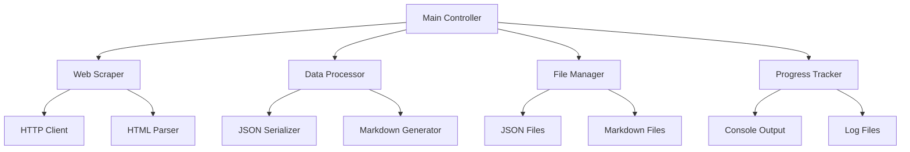

# Design Document

## Overview

RPG Developer Bakinのドキュメントスクレイピングツールは、WebスクレイピングによってBakinの公式C#リファレンスドキュメントを取得し、JSON形式で構造化して保存し、最終的にMarkdown形式に変換するシステムです。

このツールは以下の主要コンポーネントで構成されます：
- Webスクレイパー（ドキュメント取得）
- データ構造化エンジン（JSON変換）
- Markdown生成器（MD変換）
- 進行状況管理システム

## Architecture



### Core Architecture Principles

1. **モジュラー設計**: 各機能を独立したモジュールとして実装
2. **非同期処理**: 効率的なWebリクエスト処理
3. **エラー回復**: ネットワーク障害やパース エラーからの回復
4. **進行状況の可視化**: ユーザーフィードバックの提供

## Components and Interfaces

### 1. Web Scraper Module

**責任**: Bakinドキュメントサイトからのデータ取得

```python
from abc import ABC, abstractmethod
from typing import List, Optional
import asyncio

class WebScraper(ABC):
    @abstractmethod
    async def scrape_namespaces(self) -> List[NamespaceInfo]:
        pass
    
    @abstractmethod
    async def scrape_class(self, class_url: str) -> Optional[ClassInfo]:
        pass
    
    @abstractmethod
    async def scrape_methods(self, class_url: str) -> List[MethodInfo]:
        pass
```

**主要機能**:
- HTTPクライアントによるページ取得
- HTMLパーサーによる構造解析
- リトライ機構とレート制限
- 相対URLの絶対URL変換

### 2. Data Models

**NamespaceInfo**:
```python
from dataclasses import dataclass
from typing import List, Optional

@dataclass
class NamespaceInfo:
    name: str
    url: str
    classes: List['ClassInfo']
    description: Optional[str] = None
```

**ClassInfo**:
```python
@dataclass
class ClassInfo:
    name: str
    full_name: str
    url: str
    description: Optional[str]
    inheritance: Optional[str] = None
    constructors: List[ConstructorInfo] = None
    methods: List[MethodInfo] = None
    properties: List[PropertyInfo] = None
    fields: List[FieldInfo] = None
    events: List[EventInfo] = None
```

**詳細なデータモデル**:
```python
@dataclass
class ParameterInfo:
    name: str
    type: str
    description: Optional[str] = None

@dataclass
class ExceptionInfo:
    type: str
    description: str

@dataclass
class MethodInfo:
    name: str
    return_type: str
    parameters: List[ParameterInfo]
    description: Optional[str]
    is_static: bool = False
    access_modifier: str = "public"
    exceptions: List[ExceptionInfo] = None

@dataclass
class PropertyInfo:
    name: str
    type: str
    description: Optional[str]
    access_modifier: str = "public"
    getter: bool = True
    setter: bool = True
    is_static: bool = False

@dataclass
class FieldInfo:
    name: str
    type: str
    description: Optional[str]
    access_modifier: str = "public"
    is_static: bool = False
    is_readonly: bool = False
    value: Optional[str] = None

@dataclass
class EventInfo:
    name: str
    type: str
    description: Optional[str]
    access_modifier: str = "public"

@dataclass
class ConstructorInfo:
    name: str
    parameters: List[ParameterInfo]
    description: Optional[str]
    access_modifier: str = "public"
```

### 3. Data Processor Module

**責任**: データの変換と永続化

```python
class DataProcessor:
    async def save_as_json(self, namespaces: List[NamespaceInfo], file_path: str) -> None:
        pass
    
    async def load_from_json(self, file_path: str) -> List[NamespaceInfo]:
        pass
    
    async def generate_markdown(self, namespaces: List[NamespaceInfo], output_dir: str) -> None:
        pass
```

### 4. Progress Tracker Module

**責任**: 進行状況の管理と表示

```python
class ProgressTracker:
    def start_operation(self, operation_name: str, total_items: int) -> None:
        pass
    
    def update_progress(self, completed_items: int, current_item: str) -> None:
        pass
    
    def log_error(self, error: str, context: str) -> None:
        pass
    
    def complete_operation(self) -> None:
        pass
```

## Data Models

### JSON Schema Structure

```json
{
  "metadata": {
    "scrapedAt": "2025-01-14T10:30:00Z",
    "sourceUrl": "https://rpgbakin.com/csreference/doc/ja/namespaces.html",
    "version": "1.0"
  },
  "namespaces": [
    {
      "name": "Yukar.Engine.Common",
      "url": "https://rpgbakin.com/csreference/doc/ja/namespace_yukar_1_1_engine_1_1_common.html",
      "description": "Common engine functionality",
      "classes": [
        {
          "name": "CommonTerrainMaterial",
          "fullName": "Yukar.Engine.Common.CommonTerrainMaterial",
          "url": "https://rpgbakin.com/csreference/doc/ja/class_yukar_1_1_engine_1_1common_1_1_common_terrain_material.html",
          "description": "地形マテリアルの共通クラス",
          "inheritance": "System.Object",
          "constructors": [
            {
              "name": "CommonTerrainMaterial",
              "parameters": [
                {
                  "name": "materialId",
                  "type": "int",
                  "description": "マテリアルID"
                }
              ],
              "description": "新しいインスタンスを初期化します",
              "accessModifier": "public"
            }
          ],
          "methods": [
            {
              "name": "GetTexture",
              "returnType": "Texture2D",
              "parameters": [
                {
                  "name": "index",
                  "type": "int",
                  "description": "テクスチャのインデックス"
                }
              ],
              "description": "指定されたインデックスのテクスチャを取得します",
              "isStatic": false,
              "accessModifier": "public",
              "exceptions": [
                {
                  "type": "ArgumentOutOfRangeException",
                  "description": "インデックスが範囲外の場合"
                }
              ]
            },
            {
              "name": "SetMaterialProperty",
              "returnType": "void",
              "parameters": [
                {
                  "name": "propertyName",
                  "type": "string",
                  "description": "プロパティ名"
                },
                {
                  "name": "value",
                  "type": "object",
                  "description": "設定する値"
                }
              ],
              "description": "マテリアルプロパティを設定します",
              "isStatic": false,
              "accessModifier": "public"
            }
          ],
          "properties": [
            {
              "name": "MaterialId",
              "type": "int",
              "description": "マテリアルの一意識別子",
              "accessModifier": "public",
              "getter": true,
              "setter": false,
              "isStatic": false
            },
            {
              "name": "TextureCount",
              "type": "int",
              "description": "このマテリアルが持つテクスチャの数",
              "accessModifier": "public",
              "getter": true,
              "setter": false,
              "isStatic": false
            },
            {
              "name": "IsValid",
              "type": "bool",
              "description": "マテリアルが有効かどうかを示す値",
              "accessModifier": "public",
              "getter": true,
              "setter": true,
              "isStatic": false
            }
          ],
          "fields": [
            {
              "name": "DEFAULT_MATERIAL_ID",
              "type": "int",
              "description": "デフォルトマテリアルのID",
              "accessModifier": "public",
              "isStatic": true,
              "isReadonly": true,
              "value": "0"
            }
          ],
          "events": [
            {
              "name": "MaterialChanged",
              "type": "EventHandler<MaterialChangedEventArgs>",
              "description": "マテリアルが変更されたときに発生するイベント",
              "accessModifier": "public"
            }
          ]
        }
      ]
    }
  ]
}
```

### Markdown Output Structure

```
docs/
├── README.md (インデックス)
├── namespaces/
│   ├── Bakin.Core/
│   │   ├── README.md
│   │   ├── GameObject.md
│   │   └── Component.md
│   └── Bakin.Events/
│       ├── README.md
│       └── EventManager.md
```

## Error Handling

### 1. Network Error Handling

- **HTTP タイムアウト**: 30秒のタイムアウト設定
- **リトライ戦略**: 指数バックオフによる最大3回のリトライ
- **レート制限**: リクエスト間に1秒の間隔

### 2. Parsing Error Handling

- **HTML構造変更**: 柔軟なセレクター戦略
- **不完全なデータ**: 部分的なデータでも保存
- **文字エンコーディング**: UTF-8での適切な処理

### 3. File System Error Handling

- **ディスク容量不足**: 事前チェックと警告
- **権限エラー**: 適切なエラーメッセージ
- **ファイルロック**: リトライ機構

## Testing Strategy

### 1. Unit Testing

- **Web Scraper**: モックHTTPレスポンスによるテスト
- **Data Models**: シリアライゼーション/デシリアライゼーションテスト
- **Markdown Generator**: 出力フォーマットの検証

### 2. Integration Testing

- **End-to-End**: 実際のBakinサイトに対するテスト（制限付き）
- **File Operations**: 実際のファイルシステムでのテスト
- **Error Scenarios**: ネットワーク障害シミュレーション

### 3. Performance Testing

- **メモリ使用量**: 大量データ処理時のメモリ効率
- **処理速度**: スクレイピング速度の最適化
- **並行処理**: 適切な並行度の設定

## Implementation Considerations

### 1. Technology Stack

- **言語**: Python 3.9+
- **HTTPクライアント**: aiohttp (非同期HTTP処理)
- **HTMLパーサー**: BeautifulSoup4
- **JSON処理**: 標準ライブラリ json
- **Markdown生成**: カスタム実装
- **進行状況表示**: tqdm
- **リトライ処理**: tenacity

### 2. Configuration

- **設定ファイル**: config.yaml または config.json
- **環境変数**: 機密情報の管理
- **コマンドライン引数**: argparse による実行時オプション
- **依存関係管理**: requirements.txt または pyproject.toml

### 3. Logging and Monitoring

- **ログライブラリ**: 標準ライブラリ logging
- **ログレベル**: DEBUG, INFO, WARNING, ERROR
- **ログ出力**: コンソール + ファイル (RotatingFileHandler)
- **メトリクス**: 処理時間、成功率、エラー率
- **進行状況**: tqdm による視覚的プログレスバー
